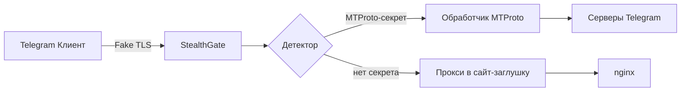

# StealthGate — Fake TLS MTProto-прокси на Rust

[](https://rustup.rs/)
[](LICENSE)

**StealthGate** — это безопасный и невероятно быстрый прокси, который маскирует трафик MTProto под обычный TLS 1.3. Использует асинхронный рантайм Tokio и библиотеку `rustls` для максимальной производительности и надёжности.

Проект написан на **Rust** — языке с нулевой стоимостью абстракций, гарантирующим безопасность памяти и потокобезопасность.

## 🎯 Возможности

- **Асинхронный I/O**: на базе `tokio`, выдерживает тысячи одновременных соединений.
- **TLS-терминация**: `rustls` для fallback-трафика, JA4-фингерпринт ClientHello.
- **Динамическая фрагментация**: разбивает начальный пакет на фрагменты для обхода DPI.
- **WebUI-дашборд**: управление пользователями, секретом MTProto, backend и фрагментацией.
- **Admin API**: Unix-сокет и REST для статистики, reload конфига, смены секрета.
- **MCP**: stdio и streamable HTTP transport для управления из Cursor/Claude.
- **Простая конфигурация** через TOML.

## 🏗️ Архитектура



- **Акцептор** — асинхронно принимает соединения.
- **Парсер TLS** — разбирает ClientHello, проверяет SNI и секрет.
- **Прокси** — использует `tokio::io::copy_bidirectional` для эффективного перенаправления.
- **Заглушка** — перенаправляет запросы на встроенный HTTP-сервер с заглушкой.

## 📦 Требования

- Rust 1.80+
- Cargo
- (Опционально) just для запуска задач

## 🚀 Установка и запуск

### Из исходников

```bash
git clone https://github.com/your-username/StealthGate.git
cd StealthGate
./scripts/gen-cert.sh          # self-signed сертификат для TLS
cargo build --release
./target/release/stealth-gate --config configs/config.toml
```

WebUI: [http://127.0.0.1:8088/ui/login.html](http://127.0.0.1:8088/ui/login.html) (логин по умолчанию `admin` / `admin123`).

### MCP-сервер

```bash
# stdio (для Cursor)
./target/release/stealth-gate-mcp --config configs/config.toml

# streamable HTTP
./target/release/stealth-gate-mcp --transport http --http-port 8090
```

### Docker

```bash
docker build -t stealth-gate .
docker run -p 443:443 -p 8088:8088 -v $(pwd)/configs:/app/configs stealth-gate
```

## ⚙️ Конфигурация

Пример `config.toml`:

```toml
[listen]
host = "0.0.0.0"
port = 443

[tls]
cert_file = "/path/to/cert.pem"
key_file = "/path/to/key.pem"
fake_domain = "www.cloudflare.com"

[mtproto]
secret = "ee0123456789abcdef..."
backend = "149.154.167.99:443"

[fallback]
static_html = "web/index.html"

[fragmentation]
enabled = true
chunk_sizes = [1, 2, 3, 2, 1]
delay_ms = 0

[admin]
socket = "/tmp/stealth-gate.sock"

[webui]
enabled = true
host = "127.0.0.1"
port = 8088
session_secret = "change-me-in-production"
users_file = "data/users.json"
```

## 🖥️ WebUI

При `webui.enabled = true` поднимается HTTP-сервер с сессиями (signed cookies) и ролями:

| Роль | Права |
|------|-------|
| `admin` | пользователи, настройки прокси, reload конфига |
| `operator` | настройки прокси, статистика |
| `viewer` | только просмотр статистики |

REST API (`/api/v1/*`):

- `POST /auth/login`, `POST /auth/logout`, `GET /auth/me`
- `GET /stats`, `GET /config`, `POST /config/reload`
- `PUT /config/mtproto` — secret, backend, fake_domain
- `PUT /config/fragmentation` — enabled, chunk_sizes, delay_ms
- `GET/POST /users`, `DELETE /users/{username}`, `PUT /users/{username}/password`

Статика дашборда: `web/dashboard/` (`login.html`, `dashboard.html`, `users.html`).

## 🔌 Подключение в Telegram

Ссылка для клиента:

```
tg://proxy?server=YOUR_IP&port=443&secret=ee0123456789...
```

## 🧪 Тестирование

```bash
cargo test          # unit-тесты
cargo test -- --ignored  # интеграционные тесты
```

## 🧩 MCP-интеграция

Бинарник `stealth-gate-mcp` предоставляет инструменты: `get_stats`, `get_config`, `reload_config`, `update_secret`.

**stdio** (Cursor):

```json
{
  "mcpServers": {
    "stealth-gate": {
      "command": "/path/to/stealth-gate-mcp",
      "args": ["--config", "/path/to/config.toml"]
    }
  }
}
```

**streamable HTTP** (`POST /mcp` на порту 8090):

```json
{
  "mcpServers": {
    "stealth-gate": {
      "url": "http://127.0.0.1:8090/mcp"
    }
  }
}
```

MCP работает напрямую с `AppState` прокси (без Unix-сокета), если оба процесса используют один конфиг.

## 📄 Лицензия

MIT © 2026 RioTwWks
