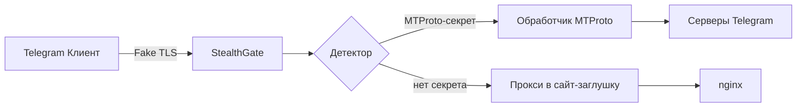

# StealthGate — Fake TLS MTProto-прокси на Rust

[](https://rustup.rs/)
[](LICENSE)

**StealthGate** — это безопасный и невероятно быстрый прокси, который маскирует трафик MTProto под обычный TLS 1.3. Использует асинхронный рантайм Tokio и библиотеку `rustls` для максимальной производительности и надёжности.

Проект написан на **Rust** — языке с нулевой стоимостью абстракций, гарантирующим безопасность памяти и потокобезопасность.

## 🎯 Возможности

- **Асинхронный I/O**: на базе `tokio`, выдерживает тысячи одновременных соединений.
- **Настоящая эмуляция TLS**: использует `rustls` с кастомизацией ClientHello (JA4-эмуляция).
- **Динамическая фрагментация**: разбивает начальный пакет на фрагменты для обхода DPI.
- **Интеграция с nginx**: заглушка для не-MTProto трафика.
- **Простая конфигурация** через TOML.

## 🏗️ Архитектура



- **Акцептор** — асинхронно принимает соединения.
- **Парсер TLS** — разбирает ClientHello, проверяет SNI и секрет.
- **Прокси** — использует `tokio::io::copy_bidirectional` для эффективного перенаправления.
- **Заглушка** — перенаправляет запросы на встроенный HTTP-сервер с заглушкой.

## 📦 Требования

- Rust 1.80+
- Cargo
- (Опционально) just для запуска задач

## 🚀 Установка и запуск

### Из исходников

```bash
git clone https://github.com/your-username/StealthGate.git
cd StealthGate
cargo build --release
./target/release/StealthGate --config configs/config.toml
```

### Через `cargo install`

```bash
cargo install StealthGate
StealthGate --config ~/.config/StealthGate/config.toml
```

### Docker

```bash
docker build -t StealthGate .
docker run -p 443:443 -v $(pwd)/configs:/app/configs StealthGate
```

## ⚙️ Конфигурация

Пример `config.toml`:

```toml
[listen]
host = "0.0.0.0"
port = 443

[tls]
cert_file = "/path/to/cert.pem"
key_file = "/path/to/key.pem"
fake_domain = "www.cloudflare.com"

[mtproto]
secret = "ee0123456789abcdef..."
backend = "149.154.167.99:443"

[fallback]
upstream = "http://localhost:8080"
```

## 🔌 Подключение в Telegram

Ссылка для клиента:

```
tg://proxy?server=YOUR_IP&port=443&secret=ee0123456789...
```

## 🧪 Тестирование

```bash
cargo test          # unit-тесты
cargo test -- --ignored  # интеграционные тесты
```

## 🧩 MCP-интеграция

В проекте реализован MCP-сервер на Rust (например, на базе `turbomcp`). Для подключения к Cursor добавьте в `~/.cursor/mcp.json`:

```json
{
  "mcpServers": {
    "StealthGate": {
      "command": "StealthGate-mcp",
      "args": ["--config", "/path/to/config.toml"]
    }
  }
}
```

Теперь вы можете управлять прокси (просмотр статистики, смена секретов, перезагрузка) через AI-ассистента.

## 📄 Лицензия

MIT © 2026 RioTwWks
