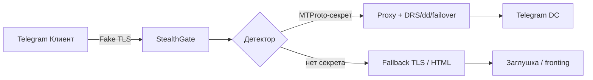
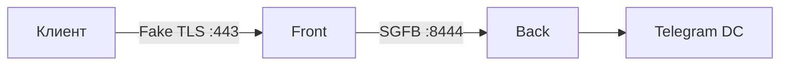

# StealthGate — Fake TLS MTProto-прокси на Rust

[](https://rustup.rs/)
[](LICENSE)

**StealthGate** — безопасный и быстрый прокси, который маскирует трафик MTProto под обычный TLS 1.3. Асинхронный рантайм Tokio, `rustls`, zero-cost abstractions Rust.

**Версия:** 0.6.0

## 🎯 Возможности

### Ядро
- **Асинхронный I/O** — тысячи одновременных соединений на Tokio.
- **TLS-терминация** — `rustls` для fallback, JA4-фингерпринт ClientHello.
- **Domain fronting** — SNI или fixed host для обхода блокировок.
- **Anti-replay** — кеш повторных ClientHello.
- **SOCKS5 chaining** — выход через upstream proxy.

### DPI-устойчивость
- **Фрагментация** — разбиение первого пакета (classic/ee-секрет).
- **Dynamic Record Sizing (DRS)** — имитация TLS record boundaries.
- **dd-протокол** — случайные размеры чанков для `dd`-секрета.

### Production
- **Multi-backend failover** — `mtproto.backends`, стратегии `priority` / `round_robin`.
- **Multi-secret** — несколько секретов с лимитами.
- **Prometheus** — `/metrics` на порту 9091, health `/healthz`.
- **Graceful shutdown** — SIGINT/SIGTERM.
- **systemd** — `deploy/install.sh` / `deploy/uninstall.sh`.

### Управление
- **WebUI** — дашборд: stats, конфиг, пользователи, QR-код, удаление сервиса.
- **Admin API** — Unix-сокет и REST для reload, secret, proxy-link.
- **MCP** — stdio и HTTP transport для Cursor/Claude.
- **Webhooks** — уведомления о config/secret/failover/start.

### Front/Back split (v0.6)
- Разделение на **edge** (front) и **relay** (back) по протоколу **SGFB**.
- Публичный сервер не подключается к Telegram DC напрямую.

## 🏗️ Архитектура

### Monolith (по умолчанию)



### Front/Back split



Подробнее: [docs/SPLIT.md](docs/SPLIT.md).

## 📦 Требования

- Rust 1.80+
- Cargo
- (Опционально) `just` для задач

## 🚀 Установка и запуск

### Из исходников

```bash
git clone https://github.com/your-username/StealthGate.git
cd StealthGate
./scripts/gen-cert.sh          # self-signed сертификат для TLS
cargo build --release
./target/release/stealth-gate --config configs/config.toml
```

WebUI: [http://127.0.0.1:8088/ui/login.html](http://127.0.0.1:8088/ui/login.html) (логин по умолчанию `admin` / `admin123`).

### Front/Back split

```bash
# Терминал 1 — internal relay
./target/release/stealth-gate --config configs/config.back.toml

# Терминал 2 — публичный edge
./target/release/stealth-gate --config configs/config.front.toml
```

Или: `just run-back` / `just run-front`.

### systemd (production)

```bash
cargo build --release
sudo bash deploy/install.sh          # установка
sudo bash deploy/uninstall.sh --purge  # удаление одной командой
```

Подробнее: [docs/DEPLOY.md](docs/DEPLOY.md).

### MCP-сервер

```bash
# stdio (для Cursor)
./target/release/stealth-gate-mcp --config configs/config.toml

# streamable HTTP
./target/release/stealth-gate-mcp --transport http --http-port 8090
```

Готовый конфиг: [`.cursor/mcp.json`](.cursor/mcp.json). Настройка Cursor: [docs/CURSOR.md](docs/CURSOR.md).

### Docker

```bash
docker build -t stealth-gate .
docker run -p 443:443 -p 8088:8088 -v $(pwd)/configs:/app/configs stealth-gate
```

## ⚙️ Конфигурация

Пример `configs/config.toml` — monolith с failover, DRS, dd, webhooks, split (закомментировано):

```toml
[listen]
host = "0.0.0.0"
port = 443

[tls]
cert_file = "certs/cert.pem"
key_file = "certs/key.pem"
fake_domain = "www.cloudflare.com"

[mtproto]
secret = "ee0123456789abcdef..."
backend = "149.154.167.99:443"
backends = ["149.154.175.50:443"]
failover_strategy = "priority"

[fragmentation]
enabled = true
chunk_sizes = [1, 2, 3, 2, 1]

[drs]
enabled = false
record_sizes = [512, 1024, 1398, 256]

[webhooks]
enabled = false
urls = []

[split]
# mode = "monolith"  # monolith | front | back

[webui]
enabled = true
host = "127.0.0.1"
port = 8088
session_secret = "change-me-in-production"
users_file = "data/users.json"
```

Полный пример с комментариями: [`configs/config.toml`](configs/config.toml).

## 🖥️ WebUI

Роли: `admin` / `operator` / `viewer`.

Основные REST API (`/api/*`):

| Группа | Эндпоинты |
|--------|-----------|
| Auth | `POST /auth/login`, `/auth/logout`, `GET /auth/me` |
| Мониторинг | `GET /stats`, `/config`, `/metrics` |
| Конфиг | `POST /config/reload`, `PUT /config/mtproto`, `PUT /config/fragmentation` |
| Telegram | `GET /proxy-link`, `GET /proxy-link/qr` (SVG) |
| Пользователи | `GET/POST /users`, `DELETE /users/{username}` |
| Система | `POST /system/uninstall` (admin, после deploy) |

Подробнее: [docs/WEBUI.md](docs/WEBUI.md).

## 🔌 Подключение в Telegram

Ссылка для клиента (также через WebUI QR или MCP `get_proxy_link`):

```
tg://proxy?server=YOUR_IP&port=443&secret=ee0123456789...
```

## 🧪 Тестирование

```bash
cargo test                    # все тесты (~62)
just test-split               # Front/Back SGFB
cargo test --test webui       # WebUI: login, API, QR
cargo test --test webhooks    # webhook-уведомления
cargo test --test service_uninstall
cargo test --test tls_handshake
cargo test --test mcp_http
cargo test -- --ignored       # сетевые интеграционные
cargo clippy -- -D warnings
```

### Webhook receiver (пример)

```bash
# Терминал 1 — приёмник
cargo run --example webhook-receiver -- --port 9999

# config.toml
[webhooks]
enabled = true
urls = ["http://127.0.0.1:9999/hook"]
```

## 🧩 MCP-инструменты

| Инструмент | Описание |
|------------|----------|
| `get_stats` | Счётчики прокси |
| `get_config` | Сводка конфигурации |
| `get_proxy_link` | tg:// ссылка |
| `reload_config` | Hot-reload config.toml |
| `update_secret` | Смена MTProto secret |

Подробнее: [docs/MCP.md](docs/MCP.md).

## 📚 Документация

| Документ | Содержание |
|----------|------------|
| [docs/CURSOR.md](docs/CURSOR.md) | Настройка MCP и workflow в Cursor |
| [docs/WEBUI.md](docs/WEBUI.md) | REST API, QR, uninstall |
| [docs/MCP.md](docs/MCP.md) | MCP транспорты и инструменты |
| [docs/DEPLOY.md](docs/DEPLOY.md) | systemd install/uninstall |
| [docs/SPLIT.md](docs/SPLIT.md) | Front/Back split (SGFB) |
| [docs/ROADMAP.md](docs/ROADMAP.md) | Статус фич v0.6.0 |

## 📄 Лицензия

MIT © 2026 RioTwWks
