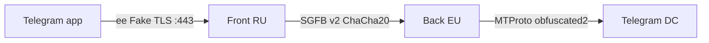

# Anti-DPI playbook (StealthGate v0.6+)

Руководство по развёртыванию StealthGate **только с встроенным MTProto-прокси Telegram** (без Zapret/Tor/сторонних клиентов) в условиях блокировок РКН/DPI.

## Топология



| Узел | Роль | Что видит DPI |
|------|------|----------------|
| **Front (RU)** | Публичный edge, Fake TLS, decoy fallback | TLS ClientHello от Telegram + «HTTPS» к RU IP |
| **Back (EU)** | Relay к Telegram DC | Только зашифрованный SGFB v2 (при `encrypt_relay = true`) |
| **WireGuard** | Транспорт RU↔EU | Обычный UDP (рекомендуется поверх SGFB v2) |

## Обязательные настройки

### 1. Только MTProto `ee` в Telegram

В настройках прокси Telegram укажите **MTProto**, не SOCKS5.

Секрет должен включать домен из `tls.fake_domain`:

```
ee<32_hex_секрета><hex_домена>
```

Пример: `fake_domain = "www.cloudflare.com"` → суффикс `…7767772e636c6f7564666c6172652e636f6d`.

### 2. Front/Back split

**RU (`config.front.toml`):**

```toml
[split]
mode = "front"
auth_token = "минимум-16-символов-общий-токен"
back_servers = ["10.66.0.2:8444"]   # IP WireGuard back, не публичный EU
encrypt_relay = true                 # SGFB v2 (по умолчанию)
connect_timeout_secs = 10

[tls]
fake_domain = "www.cloudflare.com"
cert_file = "certs/cert.pem"        # для decoy TLS / fallback
key_file = "certs/key.pem"

[drs]
enabled = true
ee_relay = true                      # DRS + jitter на ee Fake TLS (по умолчанию)
record_sizes = [512, 1024, 1398, 256]
jitter_ms = 15
```

**EU (`config.back.toml`):**

```toml
[split]
mode = "back"
auth_token = "минимум-16-символов-общий-токен"
back_listen_host = "10.66.0.2"      # только WireGuard interface
back_listen_port = 8444
front_allowlist = ["10.66.0.1"]     # IP WireGuard front
encrypt_relay = true

[mtproto]
secret = "ee..."
backend = "149.154.167.99:443"
backends = ["149.154.175.50:443"]
```

### 3. WireGuard между RU и EU

```ini
# /etc/wireguard/wg0.conf на RU
[Interface]
Address = 10.66.0.1/24
PrivateKey = <RU_private>

[Peer]
PublicKey = <EU_public>
Endpoint = <EU_public_ip>:51820
AllowedIPs = 10.66.0.2/32
PersistentKeepalive = 25
```

SGFB слушает **только** на `10.66.0.x`, не на публичном интерфейсе EU.

## Новые механизмы anti-DPI

### SGFB v2 — шифрование relay

После opening frame и plaintext ACK весь трафик Front↔Back шифруется **ChaCha20-Poly1305** (фреймы `u16_be len | ciphertext`).

- Версия в opening frame: `2` (`encrypt_relay = true`)
- Ключи: `HKDF-SHA256(auth_token, SHA256(opening_frame))`
- Отключить для отладки: `encrypt_relay = false` (версия `1`, сырой relay)

### DRS / jitter на ee relay

`[drs].ee_relay` включает:

- разбиение TLS Application Data по `record_sizes` в `FakeTlsStream`
- случайный padding внутри TLS records
- опциональный `jitter_ms` между чанками

### Decoy TLS на probe

Соединения с TLS ClientHello **без валидного ee HMAC** больше **не** попадают в MTProto-обработчик (исправлена ложная детекция по SNI).

Для probe-ботов:

1. Если заданы `cert_file` / `key_file` — полноценный TLS fallback (rustls + HTML).
2. Иначе — **decoy ServerHello + alert handshake_failure** (не MTProto Fake TLS).

## Диагностика

| Симптом | Проверка |
|---------|----------|
| Бесконечное «Подключение…» | Логи RU: `split front ee handshake timeout` → секрет/домен; EU: таймаут к DC |
| EU `b2c>0`, RU `b2c=0` | Баг relay front→client (обновите StealthGate) |
| EU `b2c>0`, RU `b2c>0`, TG молчит | DPI на участке client→RU; проверьте LTE vs Wi‑Fi |
| `SGFB` magic в трафике RU→EU | Выключен WG или `encrypt_relay = false` |
| IP в бане после сканирования | Убедитесь, что probe получает decoy/fallback, не MTProto ServerHello |

### Успешные логи

**RU Front:**
```
INFO MTProto-соединение ... split=Front
INFO split front: отправка SGFB opening-кадра на back
DEBUG split front ee: ACK получен, старт obfuscated2 relay encrypted=true
DEBUG split front-сессия завершена c2b=... b2c=...
```

**EU Back:**
```
INFO split back: принят SGFB opening-кадр ... encrypted=true
DEBUG split back ee: relay init в DC, plaintext ACK front
DEBUG split back ee-сессия завершена c2b=... b2c=...
```

## Чего прокси не исправит

- **ClientHello от официального Telegram** — генерируется клиентом, не прокси.
- **SOCKS5 в Telegram** — DPI детектирует за секунды; не используйте.
- **Публичный SGFB-порт** без WG — даже v2 лучше не светить в интернет.

## Сборка и тесты

```bash
cargo build --release
cargo test split_ee_e2e   # SGFB v2 + mock DC
just run-back             # EU
just run-front            # RU
```

См. также: [SPLIT.md](./SPLIT.md), [DEPLOY.md](./DEPLOY.md).
