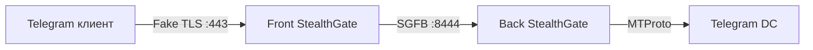

# Front/Back Split (v0.6)

Разделение StealthGate на edge-узел (**front**) и relay-узел (**back**) для сценариев, когда публичный сервер не должен напрямую подключаться к Telegram DC.

## Топология



| Режим | Роль | Публичный listen | Подключение к Telegram |
|-------|------|------------------|------------------------|
| `monolith` | Всё в одном процессе (по умолчанию) | ✅ | ✅ |
| `front` | Маскировка, детекция, anti-replay | ✅ | ❌ → relay на back |
| `back` | Relay на DC, DRS/dd/failover | internal `back_listen` | ✅ |

## Протокол SGFB

Front открывает TCP к back и отправляет opening-кадр:

```
MAGIC "SGFB" (4) | VERSION (1) | SHA256(auth_token) (32)
| secret_mode (1) | backend_len (2) | backend | initial_len (4) | initial_data
```

Back отвечает 1 байтом: `0x00` = OK, `0x01` = ошибка (+ UTF-8 сообщение).

После ACK — bidirectional relay. При `encrypt_relay = true` (protocol version 2) relay шифруется ChaCha20-Poly1305 (`src/sgfb_crypto.rs`).

## Конфигурация Front

Пример: `configs/config.front.toml`

```toml
[split]
mode = "front"
auth_token = "change-me-front-back-token"
back_servers = ["10.0.0.2:8444"]
connect_timeout_secs = 10
```

`mtproto.backend` — hint для back (какой DC использовать).

## Конфигурация Back

Пример: `configs/config.back.toml`

```toml
[split]
mode = "back"
auth_token = "change-me-front-back-token"
back_listen_host = "0.0.0.0"
back_listen_port = 8444
front_allowlist = ["10.0.0.1"]
```

## Запуск

```bash
# Back (внутренний relay, ближе к Telegram)
./target/release/stealth-gate --config configs/config.back.toml

# Front (публичный edge)
./target/release/stealth-gate --config configs/config.front.toml
```

## Безопасность

- `auth_token` — минимум 16 символов, одинаковый на front и back
- `front_allowlist` на back — ограничь IP front-узлов
- `back_listen` слушай только на internal interface / VPN
- SGFB порт не должен быть доступен из интернета

## Метрики

- `stealthgate_split_relayed_total`
- `stealthgate_split_auth_failed_total`

## Диагностика: EU не подключается к Telegram DC

Если на **front** видно `MTProto-соединение` и `split front: отправка SGFB`, а на **back** — `таймаут подключения к 149.154.x.x:443` или `нет доступных backend-серверов`, цепочка SGFB работает, но **EU-сервер не может достучаться до Telegram DC**.

### Проверка с EU-сервера

```bash
# TCP до DC (должно быть Connected / succeeded)
nc -vz -w 5 149.154.167.99 443
nc -vz -w 5 149.154.175.50 443
nc -vz -w 5 91.108.56.100 443

# Исходящий firewall
sudo iptables -L OUTPUT -n -v | head
sudo ufw status
```

Частые причины:
- хостинг блокирует исходящие к `149.154.0.0/16` (Telegram);
- закрыт исходящий TCP/443 на firewall;
- после первой неудачи оба DC помечены «unhealthy» на 30 с → `нет доступных backend-серверов` (подождите или перезапустите back).

### Обход через SOCKS5

Если прямой выход к Telegram заблокирован, в `config.back.toml`:

```toml
[network]
socks5_proxy = "socks5://127.0.0.1:1080"
backend_timeout_secs = 15
```

### Дополнительные DC в пуле

```toml
[mtproto]
backend = "149.154.167.99:443"
backends = [
  "149.154.175.50:443",
  "149.154.167.51:443",
  "91.108.56.100:443",
]
failover_strategy = "priority"
```

### Успешные логи

**RU (front):**
```
INFO MTProto-соединение ... split=Front
INFO split front: отправка SGFB opening-кадра на back
```

**EU (back):**
```
INFO split back: принят SGFB opening-кадр, подключение к Telegram DC
# без WARN про backend
```
